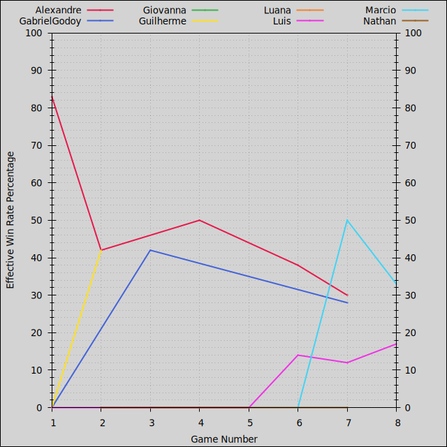
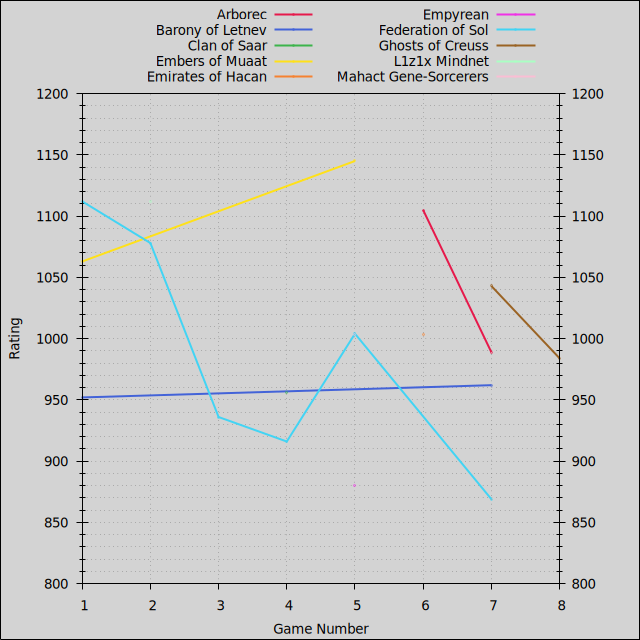

- [Players](#players): [Summary](#players-summary), [Ratings](#players-ratings), [Points](#players-points), [Win Rates](#players-win-rates)
- [Factions](#factions): [Summary](#factions-summary), [Ratings](#factions-ratings), [Points](#factions-points), [Win Rates](#factions-win-rates)
- [Duration](#duration)
- [Games](#games)
- [License](#license)

Last updated 2025-09-17 16:00 UTC.

# Players

- [Summary](#players-summary)
- [Ratings](#players-ratings)
- [Points](#players-points)
- [Win Rates](#players-win-rates)

[(Back to Top)](#)

## Players: Summary

| **Player** | **Games** | **Curr. Rating** | **Avg Rating** | **Avg Pts.** | **Win Rate** | **1st Place** | **2nd Place** | **3rd Place** |
| :--- | :---: | :---: | :---: | :---: | :---: | :---: | :---: | :---: |
| Marcio | 3 | 1114 | 1130 | 8.00 | 33% | 33% (1) | 33% (1) | 33% (1) |
| Alexandre | 5 | 997 | 1108 | 7.20 | 30% | 40% (2) | 20% (1) | 0% (0) |
| Lucas | 1 | 1107 | 1107 | 10.00 | 83% | 100% (1) | 0% (0) | 0% (0) |
| Giovanna | 2 | 1093 | 1075 | 9.00 | 0% | 0% (0) | 100% (2) | 0% (0) |
| Luis | 8 | 1188 | 1063 | 8.25 | 17% | 25% (2) | 12% (1) | 50% (4) |
| Douglas | 1 | 1047 | 1047 | 9.00 | 0% | 0% (0) | 100% (1) | 0% (0) |
| Torugo | 1 | 1029 | 1029 | 8.00 | 0% | 0% (0) | 100% (1) | 0% (0) |
| Kendy | 1 | 1024 | 1024 | 6.00 | 0% | 0% (0) | 0% (0) | 100% (1) |
| Guilherme | 2 | 1091 | 1022 | 7.00 | 42% | 50% (1) | 0% (0) | 0% (0) |
| GabrielGodoy | 3 | 1128 | 1017 | 7.00 | 28% | 33% (1) | 33% (1) | 0% (0) |
| Matheus | 1 | 1011 | 1011 | 7.00 | 0% | 0% (0) | 0% (0) | 100% (1) |
| PedroGodoy | 1 | 1006 | 1006 | 5.00 | 0% | 0% (0) | 0% (0) | 0% (0) |
| Hiago | 1 | 947 | 947 | 6.00 | 0% | 0% (0) | 0% (0) | 0% (0) |
| Jean | 1 | 945 | 945 | 7.00 | 0% | 0% (0) | 0% (0) | 0% (0) |
| Nathan | 3 | 848 | 936 | 5.67 | 0% | 0% (0) | 0% (0) | 33% (1) |
| Jota | 1 | 902 | 902 | 2.00 | 0% | 0% (0) | 0% (0) | 0% (0) |
| Felipe | 1 | 881 | 881 | 5.00 | 0% | 0% (0) | 0% (0) | 0% (0) |
| Luana | 2 | 820 | 859 | 6.00 | 0% | 0% (0) | 0% (0) | 0% (0) |

Average victory points per game are adjusted relative to 10-point games, and effective win rates are calculated relative to 6-player games.

[(Back to Players)](#players)

## Players: Ratings

[(Back to Players)](#players)

## Players: Points

Average victory points per game are adjusted relative to 10-point games.

[(Back to Players)](#players)

## Players: Win Rates

Effective win rates are calculated relative to 6-player games.

[(Back to Players)](#players)

# Factions

- [Summary](#factions-summary)
- [Ratings](#factions-ratings)
- [Points](#factions-points)
- [Win Rates](#factions-win-rates)

[(Back to Top)](#)

## Factions: Summary

| **Faction** | **Games** | **Curr. Rating** | **Avg Rating** | **Avg Pts.** | **Win Rate** | **1st Place** | **2nd Place** | **3rd Place** |
| :--- | :---: | :---: | :---: | :---: | :---: | :---: | :---: | :---: |
| Naalu Collective | 2 | 1160 | 1137 | 10.00 | 67% | 100% (2) | 0% (0) | 0% (0) |
| L1z1x Mindnet | 1 | 1112 | 1112 | 10.00 | 83% | 100% (1) | 0% (0) | 0% (0) |
| Embers of Muaat | 2 | 1145 | 1104 | 9.00 | 42% | 50% (1) | 50% (1) | 0% (0) |
| Universities of Jol-Nar | 2 | 1104 | 1083 | 8.50 | 0% | 0% (0) | 100% (2) | 0% (0) |
| Arborec | 2 | 989 | 1047 | 7.00 | 42% | 50% (1) | 0% (0) | 0% (0) |
| Nomad | 1 | 1016 | 1016 | 8.00 | 0% | 0% (0) | 100% (1) | 0% (0) |
| Ghosts of Creuss | 2 | 984 | 1013 | 7.50 | 0% | 0% (0) | 0% (0) | 100% (2) |
| Titans of Ul | 1 | 1012 | 1012 | 7.00 | 0% | 0% (0) | 0% (0) | 100% (1) |
| Sardakk N'orr | 1 | 1011 | 1011 | 7.00 | 0% | 0% (0) | 0% (0) | 100% (1) |
| Emirates of Hacan | 1 | 1003 | 1003 | 6.00 | 0% | 0% (0) | 0% (0) | 100% (1) |
| Mahact Gene-Sorcerers | 1 | 1003 | 1003 | 8.00 | 0% | 0% (0) | 0% (0) | 100% (1) |
| Vuil'raith Cabal | 2 | 1061 | 1003 | 6.50 | 0% | 0% (0) | 50% (1) | 0% (0) |
| Federation of Sol | 6 | 869 | 986 | 7.17 | 25% | 33% (2) | 17% (1) | 17% (1) |
| Barony of Letnev | 2 | 962 | 957 | 4.50 | 0% | 0% (0) | 0% (0) | 0% (0) |
| Clan of Saar | 1 | 956 | 956 | 7.00 | 0% | 0% (0) | 0% (0) | 100% (1) |
| Xxcha Kingdom | 7 | 1134 | 944 | 7.00 | 14% | 14% (1) | 29% (2) | 0% (0) |
| Yssaril Tribes | 1 | 887 | 887 | 6.00 | 0% | 0% (0) | 0% (0) | 0% (0) |
| Nekro Virus | 1 | 881 | 881 | 2.00 | 0% | 0% (0) | 0% (0) | 0% (0) |
| Empyrean | 1 | 880 | 880 | 6.00 | 0% | 0% (0) | 0% (0) | 0% (0) |

Average victory points per game are adjusted relative to 10-point games, and effective win rates are calculated relative to 6-player games.

[(Back to Factions)](#factions)

## Factions: Ratings

[(Back to Factions)](#factions)

## Factions: Points

Average victory points per game are adjusted relative to 10-point games.

[(Back to Factions)](#factions)

## Factions: Win Rates

Effective win rates are calculated relative to 6-player games.

[(Back to Factions)](#factions)

# Duration

[(Back to Top)](#)

# Games

| **Game** | **Date** | **Mode** | **Points** | **Players** | **Results** |
| :---: | :---: | :---: | :---: | :---: | :--- |
| 8 | 2025-09-14 | Free-for-All | 10 | 3 | 6h24m, 1st Luis 10 Naalu Collective, 2nd Torugo 8 Nomad, 3rd Marcio 7 Ghosts of Creuss |
| 7 | 2025-05-02 | Free-for-All | 10 | 6 | 9h38m, 1st Marcio 10 Xxcha Kingdom, 2nd GabrielGodoy 9 Vuil'raith Cabal, 3rd Luis 8 Ghosts of Creuss, 4th PedroGodoy 5 Barony of Letnev, 5th Alexandre 4 Arborec, 6th Nathan 3 Federation of Sol |
| 6 | 2025-04-19 | Free-for-All | 10 | 5 | 8h12m, 1st Luis 10 Arborec, 2nd Marcio 7 Xxcha Kingdom, 3rd Kendy 6 Emirates of Hacan, 4th Alexandre 4 Vuil'raith Cabal, 5th Jota 2 Nekro Virus |
| 5 | 2025-03-04 | Free-for-All | 10 | 5 | 9h43m, 1st Lucas 10 Embers of Muaat, 2nd Giovanna 9 Federation of Sol, 3rd Luis 8 Mahact Gene-Sorcerers, 4th Hiago 6 Xxcha Kingdom, 5th Luana 6 Empyrean |
| 4 | 2024-12-22 | Free-for-All | 10 | 4 | 7h27m, 1st Alexandre 10 Federation of Sol, 2nd Douglas 9 Xxcha Kingdom, 3rd Luis 7 Clan of Saar, 4th Nathan 6 Federation of Sol |
| 3 | 2024-10-19 | Free-for-All | 10 | 5 | 10h46m, 1st GabrielGodoy 10 Naalu Collective, 2nd Giovanna 9 Universities of Jol-Nar, 3rd Luis 7 Titans of Ul, 4th Jean 7 Xxcha Kingdom, 5th Felipe 5 Federation of Sol |
| 2 | 2024-02-17 | Free-for-All | 10 | 5 | 8h54m, 1st Guilherme 10 L1z1x Mindnet, 2nd Alexandre 8 Universities of Jol-Nar, 3rd Nathan 8 Federation of Sol, 4th Luis 8 Xxcha Kingdom, 5th Luana 6 Yssaril Tribes |
| 1 | 2023-12-23 | Free-for-All | 10 | 5 | 8h39m, 1st Alexandre 10 Federation of Sol, 2nd Luis 8 Embers of Muaat, 3rd Matheus 7 Sardakk N'orr, 4th Guilherme 4 Barony of Letnev, 5th GabrielGodoy 2 Xxcha Kingdom |

[(Back to Top)](#)

# License

This leaderboard was generated by [https://github.com/acodcha/ti4-echelon](https://github.com/acodcha/ti4-echelon), which is maintained by Alexandre Coderre-Chabot [(https://github.com/acodcha)](https://github.com/acodcha) and licensed under the MIT License. For more details, see the `LICENSE` file or [https://mit-license.org](https://mit-license.org). This work is based on the Twilight Imperium 4th Edition board game by Fantasy Flight Games. The contents, copyrights, and trademarks of everything involving Twilight Imperium 4th Edition are exclusively held by Fantasy Flight Games; I make no claim to any of these in any way.

[(Back to Top)](#)

